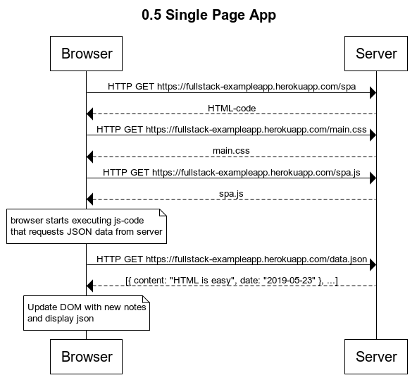
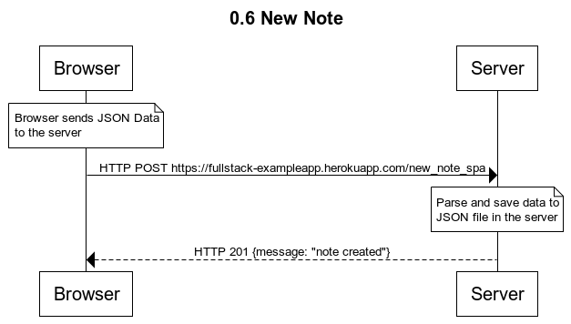

## Part 0 - [Fundamentals of Web Apps](https://fullstackopen.com/en/part0)

## [Exercise Descriptions](https://fullstackopen.com/en/part0/fundamentals_of_web_apps#exercises-0-1-0-6)

### 0.4: new note:

### 0.5: Single page application

### 0.6: New note:

